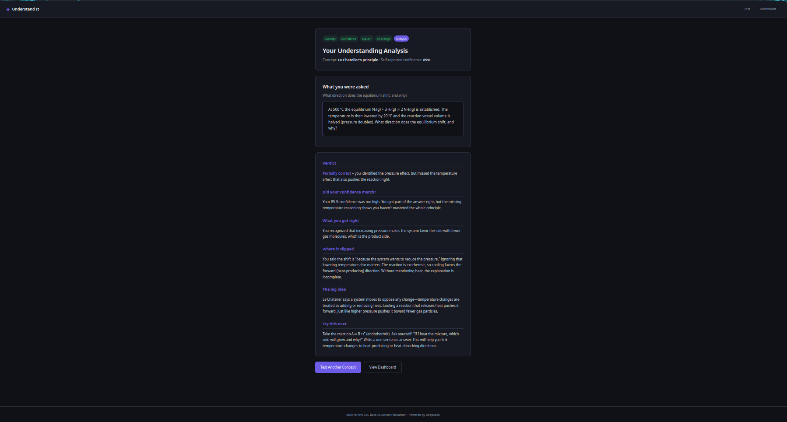
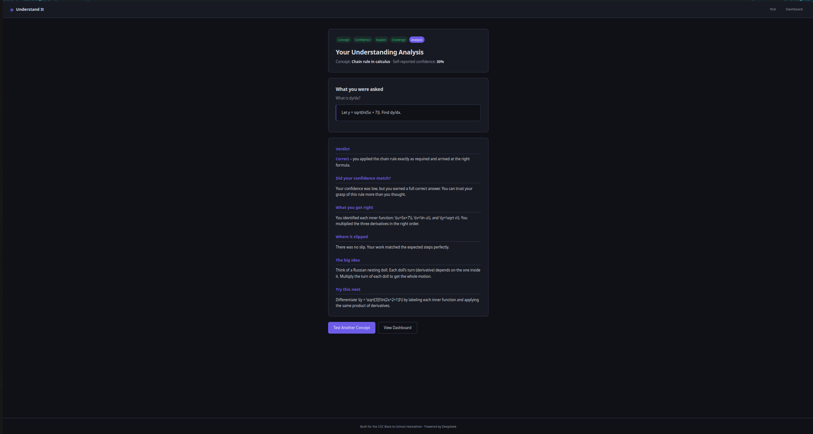
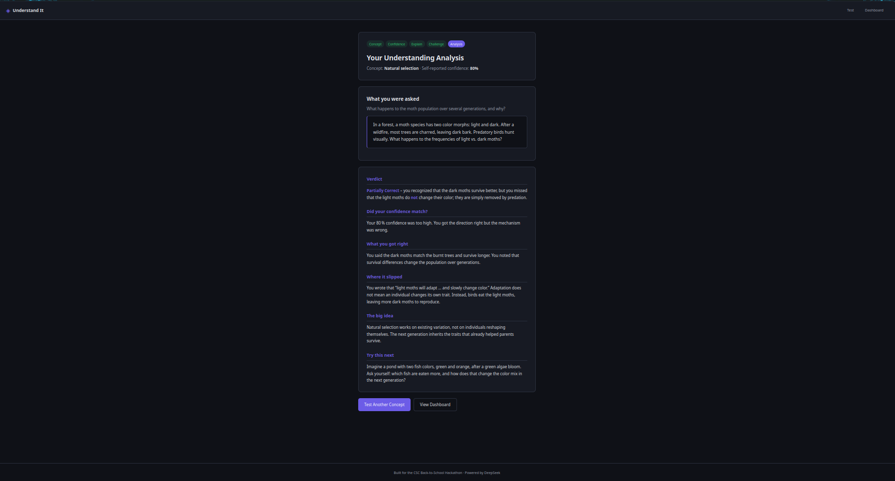
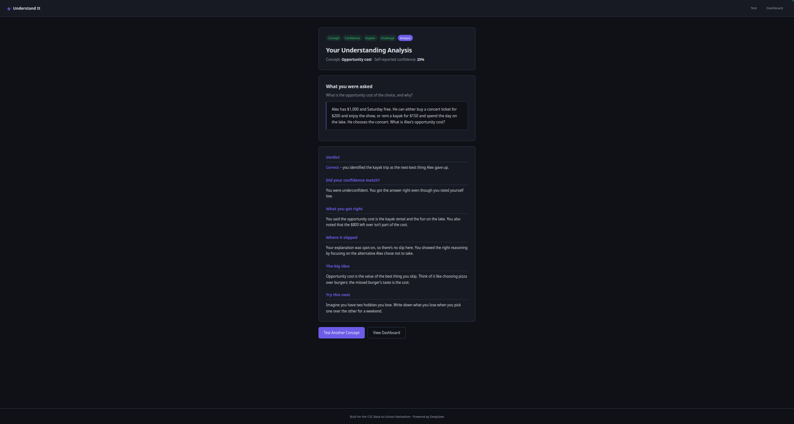

# Understand It

**Prove what you actually know — not what you recognize.**

A study tool that turns a confidence slider into a diagnostic. You tell it what you studied and how sure you feel, then it makes you prove it — through an explanation and a novel application. The AI compares what you _believed_ to what you _produced_, and shows you exactly where the gap is.

Built for the [CSC Back-to-School Hackathon](https://csc-back-to-school.devpost.com/).

---

## The problem

Recognition feels like knowledge. You reread your notes, everything looks familiar, and your brain files it away as "learned." Then you take the test and realize you couldn't actually apply any of it.

Psychologists call this the _illusion of fluency_. Nothing in the current school system catches it until it's too late.

I built Understand It because I kept hitting this exact wall — most recently with a Go algorithm problem I solved, moved on from, and then couldn't rewrite a week later. Not "it took me a minute." I genuinely couldn't reconstruct the logic I had written myself.

## How it works

The flow is five steps:

1. **Concept** — type in anything you think you understand.
2. **Confidence** — rate yourself 0–100.
3. **Explain** — teach the concept from memory, in your own words.
4. **Apply** — answer a scenario the AI generates specifically for that concept.
5. **Analysis** — the AI compares what you _believed_ to what you _produced_ and names the gap.

Every attempt is saved to a dashboard so you can see your calibration over time.

### Why it's different

Most AI study tools explain things _to_ you. Understand It makes you explain things _to it_.

And it doesn't just grade you. It measures the gap between how sure you were and how well you actually did. That gap — the calibration error — is the most useful piece of information a student can have, and almost no tool measures it.

It also catches the opposite problem: students who answer correctly but rated themselves 30% confident. Underconfidence is just as damaging as overconfidence, and most tools ignore it entirely.

---

## Screenshots

|                               Overconfident, partial understanding                                |                     Underconfident, correct                     |
| :-----------------------------------------------------------------------------------------------: | :-------------------------------------------------------------: |
|                                         |                      |
| **Chemistry** — 85% confident, missed the temperature effect that reinforces the pressure effect. | **Calculus** — 30% confident, applied the chain rule perfectly. |

|                                               Confident, wrong mechanism                                                |                                  Underconfident, correct                                   |
| :---------------------------------------------------------------------------------------------------------------------: | :----------------------------------------------------------------------------------------: |
|                                                                |                                     |
| **Biology** — 80% confident, wrote "individuals adapt" (they don't — populations change through differential survival). | **Economics** — 25% confident, explained opportunity cost cleanly with a concrete example. |

Four subjects. Two calibration directions. The tool catches both.

---

## Tech stack

| Layer    | Technology                                                    |
| :------- | :------------------------------------------------------------ |
| Frontend | Vanilla HTML / CSS / JavaScript — no framework, no build step |
| Backend  | Go                                                            |
| AI       | [Groq](https://groq.com) — `openai/gpt-oss-120b`              |
| Config   | `godotenv` for environment variables                          |

Two API calls per attempt:

1. `/challenge` — generates a prediction challenge matched to the student's concept.
2. `/analyze` — analyzes the student's explanation and answer against the expected reasoning.

Full round trip is usually under 5 seconds.

---

## Known limitations

- **Self-reported confidence is subjective.** Someone could just click 100% every time. I treat it as a signal, not a measurement — a student who inflates their score gets a less useful analysis, but the analysis still works.
- **Challenge quality depends on the model.** Sometimes the AI generates a challenge that's too easy or a little ambiguous. I've tightened the generation prompt to reduce this, but it's still an LLM. It's not going to be perfect every time.
